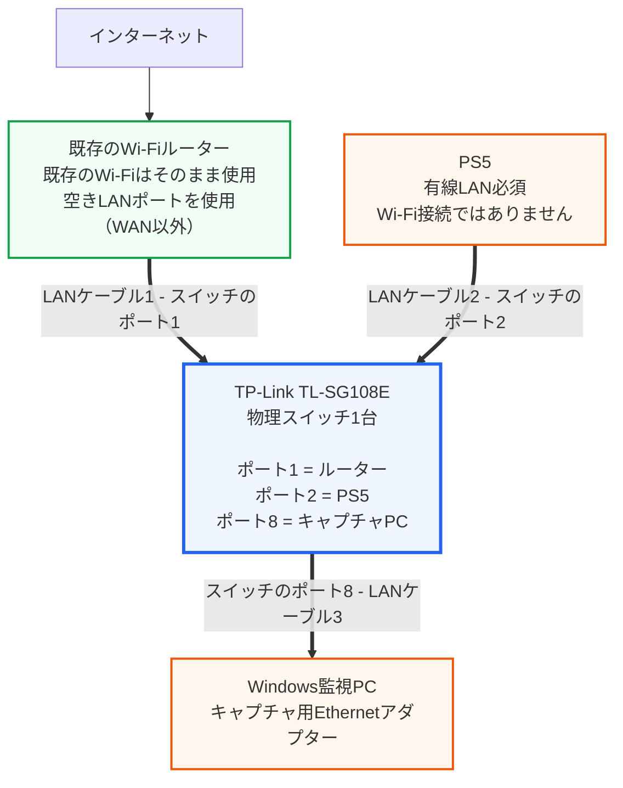

# PS5-P2PINFO

[English](README.md) | [한국어](README.ko.md) | **日本語**

PS5-P2PINFOは、ミラーリングされたPS5の有線LANトラフィックを利用して、Armored CoreのP2P接続状態を監視するWindowsアプリケーションです。

## 画面例

この画像ではPS5のMACアドレスをマスクしています。

## ダウンロード

- [最新リリースページ](https://github.com/Rubicon-Developers/PS5-P2P-INFO/releases/latest)
- [PS5-P2PINFO-Setup-x64.exeを直接ダウンロード](https://github.com/Rubicon-Developers/PS5-P2P-INFO/releases/latest/download/PS5-P2PINFO-Setup-x64.exe) — 一般的なIntel・AMD PC向け
- [PS5-P2PINFO-Setup-arm64.exeを直接ダウンロード](https://github.com/Rubicon-Developers/PS5-P2P-INFO/releases/latest/download/PS5-P2PINFO-Setup-arm64.exe) — ARM64実機で未テストの実験的ビルド

この `.exe` はポータブル実行ファイルではなく、Inno Setupで作成されたインストーラーです。アプリケーションのインストール、選択したショートカットの作成、Windowsの標準アンインストール項目の登録を行います。.NETを含むself-contained形式のため、.NETを別途インストールする必要はありません。

現在、インストーラーにはデジタルコード署名がないため、Windows SmartScreenの警告が表示される場合があります。上記のGitHub公式リリースからのみダウンロードしてください。

## 主な機能

- パイロット名のモニタリング
- PingおよびRTT Jitterの測定
- 最近のRTT Spike診断
- Packet Gap診断
- 表示およびキャプチャ設定の調整

## 関連ポリシーおよび利用規約

適用されるポリシーおよび利用規約は、国または地域によって異なります。この日本語版では、日本に居住するユーザーおよび日本のPlayStationアカウントに適用される公式リンクを案内しています。ほかの国または地域で利用する場合は、その地域の最新規約をご確認ください。ゲームまたはサービス内で個別に提示される規約も適用される場合があります。

PS5-P2PINFOは、適用される法律、プラットフォームポリシーおよびサービス利用規約を尊重し、遵守することを目的として設計されています。

- [PlayStation Network利用規約 – 日本](https://www.playstation.com/ja-jp/legal/psn-terms-of-service/)
- [PlayStationソフトウェアアプリケーション使用許諾契約 – 日本](https://www.playstation.com/ja-jp/legal/software-eula/)
- [PS5用システムソフトウェア使用許諾契約 – 日本](https://www.playstation.com/ja-jp/legal/ps5-ssla/)

## 対応環境

- Windows 10またはWindows 11 x64
- ポートミラーリングに対応したルーターまたはマネージドスイッチ
- PS5の送受信トラフィックが双方向とも監視PCへミラーリングされている環境
- **WinPcap API-compatible Mode**を有効にしてインストールした[Npcap](https://npcap.com/#download)
- インストーラーの実行に必要な管理者権限

> [!WARNING]
> Windows ARM64向けインストーラーは実験的ビルドとして個別に提供します。ビルドには成功していますが、ARM64実機ではテストしていません。そのため、ARM64でのインストール、Npcap連携、パケットキャプチャの互換性は未確認です。

Npcapを `Restrict Npcap driver's access to Administrators only` でインストールした場合、キャプチャ開始時にUACの承認が必要になることがあります。権限エラーが解消しない場合に限り、PS5-P2PINFOを管理者として実行してください。

## インストールと設定

このガイドでは、幅広い環境で利用しやすい「既存のWi-Fiルーター + TP-Link TL-SG108E」構成を使用します。TL-SG108EはWi-Fiルーターを置き換える機器ではありません。現在使用しているルーターのLANポートに追加で接続するため、スマートフォンやノートPCはこれまでどおり既存のWi-Fiを利用できます。

> [!IMPORTANT]
> 製品名末尾の `E` を必ず確認してください。`TL-SG108E` はポートミラーリングに対応していますが、`TL-SG108` はポートミラーリングに対応していない通常のアンマネージスイッチです。

### 1. 必要な機器を準備する

- Windows 10またはWindows 11 x64 PC
- 有線LANで接続するPS5
- 現在使用しているWi-Fiルーター
- [TP-Link TL-SG108E](https://www.tp-link.com/jp/business-networking/easy-smart-switch/tl-sg108e/) 8ポート ギガビット イージースマートスイッチ
- Cat5e以上のLANケーブル3本
- PCに有線LANポートがない場合は、USBギガビットEthernetアダプター1台

TL-SG108Eは、日本・韓国・米国の公式製品ページでポートミラーリング対応を確認でき、同じ公式設定ユーティリティを利用できます。日本公式ページの案内どおり、公開されているマニュアルと設定画面は英語です。このガイドでは、画面上の英語項目名をそのまま記載します。

| 地域 | 公式製品・サポート | 2026-08-10確認時の価格例 |
| --- | --- | --- |
| 日本 | [製品](https://www.tp-link.com/jp/business-networking/easy-smart-switch/tl-sg108e/)・[サポート／ダウンロード](https://www.tp-link.com/jp/support/download/tl-sg108e/) | [価格.com 約¥3,960から](https://kakaku.com/item/K0000886515/) |
| 韓国 | [製品](https://www.tp-link.com/kr/business-networking/easy-smart-switch/tl-sg108e/)・[サポート／ダウンロード](https://www.tp-link.com/kr/support/download/tl-sg108e/) | [Danawa 約36,000～43,000ウォン](https://prod.danawa.com/info/?pcode=4922979) |
| 米国 | [製品](https://www.tp-link.com/us/business-networking/easy-smart-switch/tl-sg108e/)・[サポート／ダウンロード](https://www.tp-link.com/us/support/download/tl-sg108e/) | [Lenovo 約US$29.99](https://www.lenovo.com/buy/us/en/easy-setup-switches-0avz00a) |

価格、在庫、送料は販売店や時期によって変わります。外観が似ている製品を購入する場合は、型番が正確に `TL-SG108E` であることを確認してください。

「ポートミラーリング」と「ポートフォワーディング」は別の機能です。製品説明にポートフォワーディングしか記載されていないルーターや、通常のアンマネージスイッチでは、この構成を作ることはできません。

### 2. PS5-P2PINFOインストーラーをダウンロードする

1. [最新のGitHubリリース](https://github.com/Rubicon-Developers/PS5-P2P-INFO/releases/latest)を開きます。
2. **設定 → システム → バージョン情報 → システムの種類**を確認し、**Assets**から該当するインストーラーを選択します。
   - **x64ベース プロセッサ**: [`PS5-P2PINFO-Setup-x64.exe`](https://github.com/Rubicon-Developers/PS5-P2P-INFO/releases/latest/download/PS5-P2PINFO-Setup-x64.exe) — 一般的なIntel・AMD PCはこちらを使用します。
   - **ARMベース プロセッサ**: [`PS5-P2PINFO-Setup-arm64.exe`](https://github.com/Rubicon-Developers/PS5-P2P-INFO/releases/latest/download/PS5-P2PINFO-Setup-arm64.exe) — ARM64実機で未テストの実験的ビルドです。

<!-- Screenshot: assets/setup/common/01-github-release-assets.png
     Capture the release Assets list with both architecture-specific installers visible. -->

### 3. Npcapをインストールする

PS5-P2PINFOが有線パケットを受信するにはNpcapが必要です。Wiresharkは必要ありません。Npcap Free Editionは再配布に制限があるため、PS5-P2PINFOのインストーラーには含まれていません。ユーザー自身が公式サイトから直接インストールしてください。

1. [Npcap公式ダウンロードページ](https://npcap.com/#download)を開きます。
2. **Downloading and Installing Npcap Free Edition**から最新のNpcap installerをダウンロードします。
3. インストーラーを実行し、Windowsのユーザーアカウント制御が表示されたら **はい** を選択します。
4. **Install Npcap in WinPcap API-compatible Mode**が選択されていることを確認します。現在のNpcapでは既定で選択されていますが、必ず画面で確認してください。
5. `Restrict Npcap driver's access to Administrators only` は任意です。選択しない場合は標準ユーザーでも手軽にキャプチャでき、選択した場合はキャプチャ権限が管理者に制限され、開始時にUACの承認が必要になることがあります。
6. `Support raw 802.11 traffic` は、この有線ポートミラーリング構成では必要ありません。
7. インストールを完了し、再起動を求められた場合はWindowsを再起動します。

<!-- Screenshot: assets/setup/common/02-npcap-download.png
     Capture the current Free Edition installer link on the official Npcap page. -->
<!-- Screenshot: assets/setup/common/03-npcap-winpcap-mode.png
     Capture the Npcap options page with WinPcap API-compatible Mode selected. -->

各オプションの公式説明は、[Npcap Users' Guide](https://npcap.com/guide/npcap-users-guide.html#npcap-installation)で確認できます。

### 4. PS5-P2PINFOをインストールする

1. 上で選択したx64またはARM64のインストーラーを実行します。
2. Windows SmartScreenが表示された場合は、GitHubの公式リリースからダウンロードしたことを確認します。**詳細情報** を選択し、選択したファイル名が `PS5-P2PINFO-Setup-x64.exe` または `PS5-P2PINFO-Setup-arm64.exe` であることを再確認してから **実行** を選択します。コード署名がないため、発行元は **不明な発行元** と表示される場合があります。
3. Windowsのユーザーアカウント制御が表示されたら **はい** を選択します。
4. Npcapが必要であることを知らせる画面を確認し、**OK**を選択します。
5. **Select Destination Location**でインストール先を選択します。よく分からない場合は、既定の場所をそのまま使用します。
6. **Select Additional Tasks**でデスクトップショートカットが必要な場合は、**Create a desktop shortcut**を選択します。
7. **Ready to Install**で設定内容を確認し、**Install**を選択します。
8. インストールが完了したら、**Launch PS5-P2PINFO**を選択した状態で **Finish**を押します。

<!-- Screenshot: assets/setup/common/04-smartscreen.png -->
<!-- Screenshot: assets/setup/common/05-setup-npcap-notice.png -->
<!-- Screenshot: assets/setup/common/06-setup-destination.png -->
<!-- Screenshot: assets/setup/common/07-setup-additional-tasks.png -->
<!-- Screenshot: assets/setup/common/08-setup-ready.png -->
<!-- Screenshot: assets/setup/common/09-setup-complete.png -->

### 5. LANケーブルを接続する

以降の説明では、次のポート番号を使用します。同じ番号で接続すると、設定画面の手順をそのまま進められます。

> [!NOTE]
> 図の太い3本の線だけが実際のLANケーブルです。`ポート2 → ポート8` のトラフィック複製は追加のケーブルではなく、TL-SG108Eの管理画面で行う設定です。手順7で説明します。

1. 既存のWi-Fiルーター背面にある空き **LAN** ポートと、TL-SG108Eの **ポート1** を接続します。ルーターの `WAN` または `Internet` ポートには接続しないでください。
2. PS5背面のLANポートと、TL-SG108Eの **ポート2** を接続します。
3. 監視PCのEthernetポートと、TL-SG108Eの **ポート8** を接続します。
4. TL-SG108Eの電源アダプターを接続し、約2分待ちます。
5. ケーブルを接続したポート1、2、8のリンクLEDが点灯または点滅していることを確認します。
6. PS5で **設定 → ネットワーク → 設定 → インターネット接続を設定 → 有線LANを設定 → 接続** の順に進み、有線接続を使用します。

[TP-Link日本公式製品ページ](https://www.tp-link.com/jp/business-networking/easy-smart-switch/tl-sg108e/)にも、ルーターとスイッチを接続する構成例が掲載されています。PS5をWi-Fiで接続するとポート2をトラフィックが通過しないため、この構成ではキャプチャできません。

> [!WARNING]
> ルーターとスイッチを2本のLANケーブルで重複接続しないでください。ネットワークループが発生する可能性があります。

### 6. TL-SG108Eの管理画面を開く

TL-SG108Eの画面は、ハードウェアバージョンやファームウェアによって多少異なる場合があります。最初に製品底面のラベルで、`Ver: 6.0` や `Ver: 6.6` などのハードウェアバージョンを確認してください。

1. [TL-SG108E日本公式サポートページ](https://www.tp-link.com/jp/support/download/tl-sg108e/)で、底面ラベルと一致するハードウェアバージョンを選択します。
2. 最新の **Easy Smart Configuration Utility**をダウンロードします。ZIP形式の場合は先に展開し、中にあるインストール用 `.exe` を実行します。
3. PCがTL-SG108Eのポート8に接続されている状態で、ユーティリティを起動します。
4. ユーティリティがネットワーク上のスイッチを自動検出するまで待ちます。表示されない場合は **Refresh**を選択します。
5. 検出された `TL-SG108E` の行にある **Login**アイコンを選択します。
6. 初回使用時にユーザー名とパスワードの作成を求められた場合は、画面の案内に従って新しい値を設定します。旧ファームウェアで既存のログイン情報を求められる場合、初期ユーザー名とパスワードがどちらも `admin` のことがあります。ログイン後、すぐにパスワードを変更してください。

<!-- Screenshot: assets/setup/common/10-tplink-discovery.png
     Capture TL-SG108E in Discovered Switches and point to Login. Mask the switch MAC address. -->

公式の[Easy Smart Configuration Utility User Guide - Discovering Switches](https://static.tp-link.com/upload/manual/2025/202510/20251023/1910013735_Easy%20Smart%20Configuration%20Utility_UG_1022.pdf#page=13)では、機器の検出、IPアドレスの確認、ログイン画面をスクリーンショット付きで確認できます。日本公式サポートページが案内するとおり、このUser Guideと設定画面は英語です。

### 7. PS5ポートの送受信トラフィックをミラーリングする

管理画面で **Monitoring → Port Mirror**を開き、次の値を設定します。

| 画面の項目 | 設定値 | 意味 |
| --- | --- | --- |
| `Port Mirror Status` | `Enable` | ポートミラーリングを有効にする |
| `Mirroring Port` または `Destination` | `8` | 複製されたトラフィックを受け取るPCのポート |
| `Mirrored Port` または `Source` | `2` | 監視対象となるPS5のポート |
| `Mirrored Mode` | `Both` | PS5の送信・受信を両方とも複製する |

ファームウェアの画面に `Both` がなく、ポートごとに `Ingress` と `Egress` が分かれて表示される場合は、**ポート2の両方をEnable**に設定します。

- `Ingress`：PS5がポート2を通してスイッチへ送るトラフィック
- `Egress`：スイッチがポート2を通してPS5へ送るトラフィック

この画像は入力する値を示す説明用イラストです。実際の画面は、ハードウェアバージョンやファームウェアによって異なる場合があります。

最後に **Apply**を選択します。

<!-- Screenshot: assets/setup/common/11-tplink-port-mirror-both.png
     Capture Monitoring > Port Mirror with Status=Enable, Mirroring Port=8,
     Mirrored Port=2, Mirrored Mode=Both. -->
<!-- Screenshot: assets/setup/common/12-tplink-port-mirror-directions.png
     Alternative UI: capture port 2 with Ingress=Enable and Egress=Enable,
     and Mirroring Port=8. -->

[TP-Link公式設定マニュアル - Configuring Port Mirror](https://static.tp-link.com/upload/manual/2025/202510/20251023/1910013735_Easy%20Smart%20Configuration%20Utility_UG_1022.pdf#page=48)には、実際のポートミラーリング設定画面がスクリーンショット付きで掲載されています。マニュアル上の44～45ページ（PDFの48～49ページ）で、`Both` 方式と `Ingress/Egress` 方式の両方を確認できます。

> [!CAUTION]
> ポート1はルーターにつながるアップリンクです。ポート1を `Mirrored/Source` に選ぶと、家庭内のほかの有線機器のトラフィックまで複製される可能性があります。PS5が接続されているポート2だけを選択してください。

### 8. PS5の有線LAN MACアドレスを確認する

PS5には、Wi-Fi用と有線LAN用で別々のMACアドレスがあります。PS5-P2PINFOには、必ず **有線LANのMACアドレス**を入力してください。

1. PS5のホーム画面右上にある **設定**を開きます。
2. **システム → システムソフトウェア → 本体情報**の順に進みます。
3. **MACアドレス（LANケーブル）**を書き留めます。
4. **MACアドレス（Wi-Fi）**は使用しません。

詳しいメニュー位置は、[PlayStation公式のPS5本体情報ガイド](https://www.playstation.com/ja-jp/support/hardware/playstation-system-software-application-version/)で確認できます。

<!-- Screenshot: assets/setup/ja/13-ps5-lan-mac.png
     Capture Console Information in Japanese. Mask console name, serial number and all real addresses. -->

### 9. キャプチャ用Ethernetアダプターを選択する

1. PS5-P2PINFOを起動し、**Config**タブを開きます。
2. **Choose Interface...**を選択します。
3. TL-SG108Eのポート8につながっているPCの物理Ethernetアダプターを選択します。
4. 選択した行が強調表示されていることを確認し、**Use Selected**を押します。

アプリケーション起動時にEthernetアダプターの候補が自動選択される場合がありますが、実際にポート8へ接続されているアダプターか、必ず確認してください。ケーブルを一度抜いてから挿し直し、Windows上で接続状態が変わるEthernetアダプターを探すと判別しやすくなります。

選択する名前の例は、`Realtek PCIe GbE Family Controller`、`Intel(R) Ethernet Controller`、`USB Gigabit Ethernet` です。次の項目は選択しないでください。

- Wi-FiまたはWirelessアダプター
- `NPF_Loopback` または `Adapter for loopback capture`
- Bluetoothアダプター
- VPN、Hyper-V、VMware、VirtualBoxなどの仮想アダプター

<!-- Screenshot: assets/setup/common/14-app-interface-selection.png
     Capture a physical Ethernet row selected and the Use Selected button. -->

### 10. PS5のMACアドレスを保存する

1. **Config**タブの **PS5 MAC Address**に、先ほど確認した有線LANのMACアドレスを入力します。
2. `AA:BB:CC:DD:EE:FF` のように、2文字ごとにコロンで区切る形式を推奨します。
3. **Promiscuous mode**を選択した状態にします。
4. そのほかの詳細設定は、最初は既定値のまま使用します。
5. **Save Config**を選択します。
6. **Log**タブに `Configuration saved.` と表示されることを確認します。

<!-- Screenshot: assets/setup/common/15-app-config.png
     Capture Config with the interface selected, a masked sample MAC,
     Promiscuous mode enabled and Save Config visible. -->

### 11. キャプチャを開始する

1. **Monitor**タブへ移動します。
2. ウィンドウ上部の **Start Capture**を選択します。
3. ステータスが `Ready` から `Capturing` に変わることを確認します。
4. PS5でArmored Coreのオンラインロビーまたはマッチに入ります。
5. P2Pトラフィックが検出されると、`Active peers` の数とモニター表が更新されます。
6. 終了するには **Stop**を選択します。

**Start Capture**を押したときにも、現在の設定は自動保存されます。**Save Config**は、キャプチャ開始前に保存結果を明示的に確認したい場合に使用できます。

<!-- Screenshot: assets/setup/common/16-app-capturing.png
     Capture Status=Capturing and Active peers. Mask any user-identifying values. -->

### トラブルシューティング

#### Start Captureが無効になっている

- Ethernetキャプチャインターフェースが選択されているか確認します。
- コロン、ハイフン、ピリオドを除いた16進数文字 `0–9`、`A–F` が12文字あるか確認します。例：`AA:BB:CC:DD:EE:FF`。
- Wi-Fi用ではなく、PS5の有線LAN用MACアドレスを入力したか確認します。

#### Start Captureを押すとアプリケーションが終了する、またはStart failedと表示される

- Npcapを最新バージョンで再インストールします。
- WinPcap API-compatible Modeが選択されているか確認します。
- Npcapを管理者専用モードでインストールした場合は、キャプチャ開始時のUAC要求を承認します。権限エラーが続く場合は、PS5-P2PINFOを **管理者として実行**します。
- **Log**タブの最後のエラーメッセージを確認します。

#### CapturingのままActive peersが0から変わらない

- PS5がWi-Fiではなく、TL-SG108Eのポート2へ有線接続されているか確認します。
- `Mirrored/Source = 2` と `Mirroring/Destination = 8` の順序が逆になっていないか確認します。
- `Both`、またはポート2の `Ingress + Egress` が両方とも有効か確認します。
- PCがポート8へ接続され、アプリケーションでその物理Ethernetアダプターを選択しているか確認します。
- 実際にP2P通信が発生するオンラインロビーまたはマッチへ入っているか確認します。

#### Pingが異常に高い、または表示されない

- 片方向だけをミラーリングすると、要求と応答の組み合わせを正しく特定できない場合があります。ポート2の送信・受信が両方ともミラーリングされているか確認します。
- ルーターのアップリンクであるポート1ではなく、PS5を直接接続したポート2だけを監視対象にします。

#### キャプチャ中にPCでインターネットを利用しにくい

監視PCでは、TL-SG108Eのポート8につないだEthernetをキャプチャ用に使用しながら、Wi-Fiを通常のインターネット接続として併用できます。Windowsのネットワークブリッジやインターネット接続の共有は有効にしないでください。

## ソースとライセンス

このリポジトリでは、リリースバイナリとドキュメントのみを配布します。ソースコードは公開しておらず、オープンソースライセンスも付与していません。Copyright © 2026 Rubicon Developers. All rights reserved.

## 免責事項

本アプリケーションは独立したコミュニティツールであり、Sony Interactive Entertainment、FromSoftware、Bandai Namco Entertainmentとの提携または公式な承認を受けた製品ではありません。
