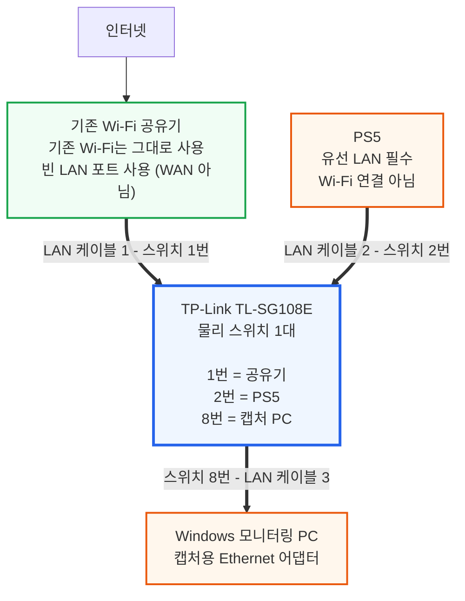

# PS5-P2PINFO

[English](README.md) | **한국어** | [日本語](README.ja.md)

PS5-P2PINFO는 미러링된 PS5 유선 LAN 트래픽을 이용해 Armored Core의 P2P 연결 상태를 모니터링하는 Windows 프로그램입니다.

## 예시 화면

이 이미지의 PS5 MAC 주소는 마스킹되어 있습니다.

## 다운로드

- [최신 릴리스 페이지](https://github.com/Rubicon-Developers/PS5-P2P-INFO/releases/latest)
- [PS5-P2PINFO-Setup-x64.exe 바로 다운로드](https://github.com/Rubicon-Developers/PS5-P2P-INFO/releases/latest/download/PS5-P2PINFO-Setup-x64.exe) — 대부분의 Intel·AMD PC
- [PS5-P2PINFO-Setup-arm64.exe 바로 다운로드](https://github.com/Rubicon-Developers/PS5-P2P-INFO/releases/latest/download/PS5-P2PINFO-Setup-arm64.exe) — 실제 ARM64 기기에서 테스트하지 않은 실험적 빌드

이 `.exe` 파일은 포터블 실행 파일이 아니라 Inno Setup으로 제작된 설치 프로그램입니다. 애플리케이션을 설치하고, 선택한 바로가기를 생성하며, Windows의 표준 앱 제거 항목을 등록합니다. .NET을 포함한 self-contained 방식이므로 별도로 .NET을 설치할 필요는 없습니다.

현재 설치 파일에는 디지털 코드 서명이 적용되지 않아 Windows SmartScreen 경고가 표시될 수 있습니다. 위의 공식 GitHub 릴리스 주소에서만 설치 파일을 다운로드하세요.

## 주요 기능

- 파일럿 이름 모니터링
- Ping 및 RTT Jitter 추정값
- 최근 RTT Spike 진단
- Packet Gap 진단
- 화면 및 캡처 설정 조정

> [!NOTE]
> Ping과 RTT Jitter는 미러링된 PS5 패킷의 요청·응답 시점을 바탕으로 계산한 **참고용 추정치**입니다. PC나 콘솔에서 직접 수행하는 일반적인 ping 테스트와 측정 방식이 달라 결과가 일치하지 않을 수 있으며, 같은 수준의 정확한 지연 시간 측정값으로 보아서는 안 됩니다. 수치 자체보다는 연결 상태의 대략적인 경향과 변화를 확인하는 용도로만 사용하세요.

## 관련 정책 및 약관

적용되는 정책과 약관은 국가 또는 지역마다 다릅니다. 이 한국어 문서에는 대한민국 거주자 및 한국 PlayStation 계정에 해당하는 공식 링크를 안내합니다. 다른 국가 또는 지역에서 사용하는 경우 해당 지역의 최신 약관을 확인해 주세요. 게임이나 서비스 내에서 별도로 제시되는 약관도 적용될 수 있습니다.

PS5-P2PINFO는 적용되는 법률과 플랫폼 정책 및 서비스 약관을 존중하고 준수하는 것을 목적으로 설계되었습니다.

- [PlayStation 서비스 이용약관 – 대한민국](https://www.playstation.com/ko-kr/legal/psn-terms-of-service/)
- [PlayStation 소프트웨어 애플리케이션 사용권 계약 – 대한민국](https://www.playstation.com/ko-kr/legal/software-eula/)
- [PS5 시스템 소프트웨어 라이선스 약관 – 대한민국](https://www.playstation.com/ko-kr/legal/ps5-ssla/)
- [Bandai Namco Entertainment Korea 이용약관](https://www.bandainamcoent.asia/ko-kr/terms-of-use)

## 지원 환경

- [.NET 공식 지원 운영체제 목록](https://github.com/dotnet/core/blob/main/release-notes/10.0/supported-os.md)에 현재 포함된 Windows 11 x64 릴리스 — Windows 11 Home 빌드 26200 실제 기기에서 동작 확인
- Windows 10 x64 — [.NET 공식 지원 운영체제 목록](https://github.com/dotnet/core/blob/main/release-notes/10.0/supported-os.md)에 현재 포함된 Enterprise 또는 LTSC 릴리스만 해당하며, 이 프로젝트에서는 Windows 10 실제 기기로 테스트하지 않음
- 포트 미러링을 지원하는 공유기 또는 관리형 스위치
- PS5 송신·수신 양방향 트래픽이 모니터링 PC로 미러링된 환경
- **WinPcap API-compatible Mode**를 활성화하여 설치한 [Npcap](https://npcap.com/#download)
- 설치 프로그램 실행을 위한 관리자 권한

> [!WARNING]
> Windows ARM64용 설치 파일은 실험적 빌드로 별도 제공합니다. 빌드는 정상적으로 완료됐지만 실제 ARM64 기기에서는 테스트하지 않았습니다. 따라서 ARM64에서의 설치, Npcap 연동 및 패킷 캡처 호환성은 아직 확인되지 않았습니다.

Npcap을 `Restrict Npcap driver's access to Administrators only`로 설치하면 캡처를 시작할 때 UAC 승인이 필요할 수 있습니다. 권한 오류가 계속될 때만 PS5-P2PINFO를 관리자 권한으로 실행하세요.

## 설치 및 설정

이 안내에서는 가장 범용적인 `기존 Wi-Fi 공유기 + TP-Link TL-SG108E` 구성을 사용합니다. TL-SG108E는 Wi-Fi 공유기를 교체하는 장비가 아닙니다. 현재 사용 중인 공유기의 LAN 포트에 추가로 연결하므로 스마트폰과 노트북은 기존 Wi-Fi를 그대로 사용할 수 있습니다.

> [!IMPORTANT]
> 모델명 끝의 `E`를 반드시 확인하세요. `TL-SG108E`는 포트 미러링을 지원하지만 `TL-SG108`은 포트 미러링을 지원하지 않는 일반 비관리형 스위치입니다.

### 1. 필요한 장비 준비

- 지원되는 x64 PC: 현재 지원되는 Windows 11 또는 .NET이 지원하는 Windows 10 Enterprise/LTSC 릴리스
- 유선 LAN으로 연결할 PS5
- 현재 사용 중인 Wi-Fi 공유기
- [TP-Link TL-SG108E](https://www.tp-link.com/kr/business-networking/easy-smart-switch/tl-sg108e/) 8포트 기가비트 이지 스마트 스위치
- Cat5e 이상 LAN 케이블 3개
- 캡처 전용 **USB 기가비트 Ethernet 어댑터 1개** — PC에 유선 LAN 포트가 없다면 필요합니다. 이미 유선 포트가 있어도, 캡처 중 PC의 기존 유선 인터넷 연결을 유지하려면 **추가(여분) 어댑터**로 사용하면 편리합니다. PC가 일반 인터넷 연결에 Wi-Fi를 사용한다면 캡처용 Ethernet 어댑터 1개만으로 충분합니다.

TL-SG108E는 한국·일본·미국의 공식 제품 페이지에서 포트 미러링 지원이 확인되며, 같은 공식 설정 유틸리티를 사용할 수 있습니다.

| 지역 | 공식 제품·지원 | 2026-08-10 확인 가격 예시 |
| --- | --- | --- |
| 대한민국 | [제품](https://www.tp-link.com/kr/business-networking/easy-smart-switch/tl-sg108e/) · [지원/다운로드](https://www.tp-link.com/kr/support/download/tl-sg108e/) | [다나와 약 3.6만~4.3만원](https://prod.danawa.com/info/?pcode=4922979) |
| 일본 | [제품](https://www.tp-link.com/jp/business-networking/easy-smart-switch/tl-sg108e/) · [지원/다운로드](https://www.tp-link.com/jp/support/download/tl-sg108e/) | [価格.com 약 ¥3,960부터](https://kakaku.com/item/K0000886515/) |
| 미국 | [제품](https://www.tp-link.com/us/business-networking/easy-smart-switch/tl-sg108e/) · [지원/다운로드](https://www.tp-link.com/us/support/download/tl-sg108e/) | [Lenovo 약 US$29.99](https://www.lenovo.com/buy/us/en/easy-setup-switches-0avz00a) |

가격, 재고, 배송비는 판매처와 시점에 따라 달라질 수 있습니다. 비슷하게 생긴 제품을 구입할 때는 모델명이 정확히 `TL-SG108E`인지 확인하세요.

`포트 미러링`과 `포트 포워딩`은 서로 다른 기능입니다. 제품 설명에 포트 포워딩만 적혀 있는 공유기나 일반 스위칭 허브로는 이 구성을 만들 수 없습니다.

### 2. PS5-P2PINFO 설치 파일 다운로드

1. [최신 GitHub 릴리스](https://github.com/Rubicon-Developers/PS5-P2P-INFO/releases/latest)를 엽니다.
2. **설정 → 시스템 → 정보 → 시스템 종류**를 확인하고 **Assets**에서 맞는 설치 파일을 선택합니다.
   - **x64 기반 프로세서**: [`PS5-P2PINFO-Setup-x64.exe`](https://github.com/Rubicon-Developers/PS5-P2P-INFO/releases/latest/download/PS5-P2PINFO-Setup-x64.exe) — 대부분의 Intel·AMD PC는 이것을 사용합니다.
   - **ARM 기반 프로세서**: [`PS5-P2PINFO-Setup-arm64.exe`](https://github.com/Rubicon-Developers/PS5-P2P-INFO/releases/latest/download/PS5-P2PINFO-Setup-arm64.exe) — 실제 ARM64 기기에서 테스트하지 않은 실험적 빌드입니다.

<!-- Screenshot: assets/setup/common/01-github-release-assets.png
     Capture the release Assets list with both architecture-specific installers visible. -->

### 3. Npcap 설치

PS5-P2PINFO는 유선 패킷을 수신하기 위해 Npcap이 필요합니다. Wireshark는 필요하지 않습니다. Npcap은 PS5-P2PINFO 설치 파일에 포함하지 않으므로 사용자가 공식 사이트에서 직접 설치해야 합니다. Npcap Free Edition은 최대 5대 시스템에서 사용할 수 있고 외부 재배포는 허용되지 않습니다. 이 범위를 벗어나 사용하는 경우 [Npcap 공식 라이선스 안내](https://npcap.com/#download)를 확인하세요.

1. [Npcap 공식 다운로드 페이지](https://npcap.com/#download)를 엽니다.
2. **Downloading and Installing Npcap Free Edition**에서 최신 Npcap installer를 다운로드합니다.
3. 설치 파일을 실행하고 Windows의 관리자 권한 요청에서 **예**를 선택합니다.
4. **Install Npcap in WinPcap API-compatible Mode**가 선택되어 있는지 확인합니다. 현재 Npcap에서는 기본으로 선택되지만 직접 확인하세요.
5. `Restrict Npcap driver's access to Administrators only`는 선택 사항입니다. 선택하지 않으면 일반 사용자도 캡처할 수 있어 편리하고, 선택하면 캡처 접근이 관리자에게 제한되어 시작 시 UAC 승인이 필요할 수 있습니다.
6. `Support raw 802.11 traffic`은 이 유선 포트 미러링 구성에 필요하지 않습니다.
7. 설치를 완료하고, 재시작 안내가 표시되면 Windows를 재시작합니다.

<!-- Screenshot: assets/setup/common/02-npcap-download.png
     Capture the current Free Edition installer link on the official Npcap page. -->
<!-- Screenshot: assets/setup/common/03-npcap-winpcap-mode.png
     Capture the Npcap options page with WinPcap API-compatible Mode selected. -->

설치 옵션의 공식 설명은 [Npcap Users' Guide](https://npcap.com/guide/npcap-users-guide.html#npcap-installation)에서 확인할 수 있습니다.

### 4. PS5-P2PINFO 설치

1. 위에서 선택한 x64 또는 ARM64 설치 파일을 실행합니다.
2. Windows SmartScreen이 표시되면 공식 GitHub 릴리스에서 다운로드했는지 확인합니다. **추가 정보**를 선택한 뒤 선택한 파일 이름이 `PS5-P2PINFO-Setup-x64.exe` 또는 `PS5-P2PINFO-Setup-arm64.exe`인지 다시 확인하고 **실행**을 선택합니다. 코드 서명이 없으므로 게시자는 `알 수 없는 게시자`로 표시될 수 있습니다.
3. Windows 관리자 권한 요청에서 **예**를 선택합니다.
4. Npcap이 필요하다는 안내 창의 내용을 확인하고 **OK**를 선택합니다.
5. **Select Destination Location**에서 설치 폴더를 선택합니다. 잘 모르겠다면 기본 경로를 그대로 사용합니다.
6. **Select Additional Tasks**에서 바탕 화면 바로가기가 필요하면 **Create a desktop shortcut**을 선택합니다.
7. **Ready to Install**에서 설정을 확인하고 **Install**을 선택합니다.
8. 설치가 끝나면 **Launch PS5-P2PINFO**를 선택한 상태로 **Finish**를 누릅니다.

<!-- Screenshot: assets/setup/common/04-smartscreen.png -->
<!-- Screenshot: assets/setup/common/05-setup-npcap-notice.png -->
<!-- Screenshot: assets/setup/common/06-setup-destination.png -->
<!-- Screenshot: assets/setup/common/07-setup-additional-tasks.png -->
<!-- Screenshot: assets/setup/common/08-setup-ready.png -->
<!-- Screenshot: assets/setup/common/09-setup-complete.png -->

### 5. LAN 케이블 연결

아래 포트 번호를 그대로 사용하면 이후 설정을 쉽게 따라갈 수 있습니다.

> [!NOTE]
> 그림의 굵은 선 3개만 실제 LAN 케이블입니다. `2번 포트 → 8번 포트` 트래픽 복제는 추가 케이블이 아니라 TL-SG108E 관리 화면에서 지정하는 설정이며, 아래 7단계에서 설명합니다.

1. 기존 Wi-Fi 공유기 뒷면의 비어 있는 **LAN** 포트와 TL-SG108E **1번 포트**를 연결합니다. 공유기의 `WAN` 또는 `Internet` 포트에 연결하지 마세요.
2. PS5 뒷면의 LAN 포트와 TL-SG108E **2번 포트**를 연결합니다.
3. 모니터링 PC의 Ethernet 포트와 TL-SG108E **8번 포트**를 연결합니다.
4. TL-SG108E의 전원 어댑터를 연결하고 약 2분 동안 기다립니다.
5. 케이블을 연결한 1번, 2번, 8번 포트의 링크 LED가 켜지거나 깜박이는지 확인합니다.
6. PS5에서 **설정 → 네트워크 → 설정 → 인터넷 접속 설정하기 → 유선 LAN 설정 → 접속** 순서로 이동하여 유선 연결을 사용합니다.

[TP-Link의 한국어 TL-SG108E 연결 가이드](https://www.tp-link.com/kr/document/27980/)에서도 스위치의 포트 하나를 공유기의 LAN 포트에 연결하도록 안내합니다. PS5를 Wi-Fi로 연결하면 2번 물리 포트에 트래픽이 지나가지 않으므로 이 구성으로 캡처할 수 없습니다.

> [!WARNING]
> 공유기와 스위치를 LAN 케이블 두 개로 중복 연결하지 마세요. 네트워크 루프가 발생할 수 있습니다.

### 6. TL-SG108E 관리 화면 열기

TL-SG108E의 화면은 하드웨어 버전과 펌웨어에 따라 조금 다를 수 있습니다. 먼저 제품 바닥면 라벨에서 `Ver: 6.0`, `Ver: 6.4`와 같은 하드웨어 버전을 확인하세요.

1. [TL-SG108E 공식 지원 페이지](https://www.tp-link.com/kr/support/download/tl-sg108e/)에서 라벨과 일치하는 하드웨어 버전을 선택합니다.
2. **Easy Smart Configuration Utility** 최신 버전을 다운로드합니다. 파일이 ZIP 형식이면 먼저 압축을 풀고, 안에 있는 설치용 `.exe`를 실행해 설치합니다.
3. PC가 TL-SG108E 8번 포트에 연결된 상태에서 유틸리티를 실행합니다.
4. 유틸리티가 네트워크의 스위치를 자동으로 찾을 때까지 기다립니다. 보이지 않으면 **Refresh**를 선택합니다.
5. 검색된 `TL-SG108E` 행의 **Login** 아이콘을 선택합니다.
6. 처음 사용하는 장치가 사용자 이름과 비밀번호 생성을 요구하면 화면의 안내에 따라 새 값을 설정합니다. 구형 펌웨어가 기존 로그인을 요구하는 경우 초기 사용자 이름과 비밀번호가 모두 `admin`일 수 있으므로, 로그인 후 즉시 비밀번호를 변경하세요.

<!-- Screenshot: assets/setup/common/10-tplink-discovery.png
     Capture TL-SG108E in Discovered Switches and point to Login. Mask the switch MAC address. -->

공식 [Easy Smart Configuration Utility User Guide - Discovering Switches](https://static.tp-link.com/upload/manual/2025/202510/20251023/1910013735_Easy%20Smart%20Configuration%20Utility_UG_1022.pdf#page=13)에서 장치 검색, IP 확인, 로그인 화면을 볼 수 있습니다.

### 7. PS5 포트의 양방향 트래픽 미러링

관리 화면에서 **Monitoring → Port Mirror**를 엽니다. 다음 값만 설정합니다.

| 화면 항목 | 설정값 | 의미 |
| --- | --- | --- |
| `Port Mirror Status` | `Enable` | 포트 미러링 켜기 |
| `Mirroring Port` 또는 `Destination` | `8` | 복사된 트래픽을 받을 PC 포트 |
| `Mirrored Port` 또는 `Source` | `2` | 감시할 PS5 포트 |
| `Mirrored Mode` | `Both` | PS5 송신·수신 모두 복사 |

펌웨어 화면에 `Both`가 없고 포트별 `Ingress`와 `Egress`가 따로 표시된다면 **2번 포트의 두 항목을 모두 Enable**로 설정합니다.

- `Ingress`: PS5가 2번 포트를 통해 스위치로 보내는 트래픽
- `Egress`: 스위치가 2번 포트를 통해 PS5로 보내는 트래픽

위 그림은 따라 입력할 값을 보여주는 설명용 이미지입니다. 실제 화면 모양은 하드웨어 버전과 펌웨어에 따라 다를 수 있습니다.

마지막으로 **Apply**를 선택합니다.

<!-- Screenshot: assets/setup/common/11-tplink-port-mirror-both.png
     Capture Monitoring > Port Mirror with Status=Enable, Mirroring Port=8,
     Mirrored Port=2, Mirrored Mode=Both. -->
<!-- Screenshot: assets/setup/common/12-tplink-port-mirror-directions.png
     Alternative UI: capture port 2 with Ingress=Enable and Egress=Enable,
     and Mirroring Port=8. -->

[TP-Link 공식 설정 설명서 - Configuring Port Mirror](https://static.tp-link.com/upload/manual/2025/202510/20251023/1910013735_Easy%20Smart%20Configuration%20Utility_UG_1022.pdf#page=48)에는 실제 설정 화면이 수록되어 있습니다. 설명서 표기 44~45쪽(PDF 48~49쪽)에서 `Both` 방식과 `Ingress/Egress` 방식 두 가지를 모두 확인할 수 있습니다.

> [!CAUTION]
> 1번 포트는 공유기와 연결된 업링크입니다. 1번 포트를 `Mirrored/Source`로 선택하면 집안의 다른 유선 장치 트래픽까지 함께 복제될 수 있으므로, PS5가 연결된 2번 포트만 선택하세요.

### 8. PS5의 유선 LAN MAC 주소 확인

PS5에는 Wi-Fi용 MAC 주소와 유선 LAN용 MAC 주소가 따로 있습니다. PS5-P2PINFO에는 반드시 **유선 LAN MAC 주소**를 입력해야 합니다.

1. PS5 홈 화면 오른쪽 위의 **설정**을 엽니다.
2. **시스템 → 시스템 소프트웨어 → 콘솔 정보**로 이동합니다.
3. **MAC 주소(LAN 케이블)**를 적어 둡니다.
4. **MAC 주소(Wi-Fi)**는 사용하지 않습니다.

자세한 메뉴 위치는 [PlayStation 공식 PS5 콘솔 정보 안내](https://www.playstation.com/ko-kr/support/hardware/playstation-system-software-application-version/)에서 확인할 수 있습니다.

<!-- Screenshot: assets/setup/ko/13-ps5-lan-mac.png
     Capture Console Information in Korean. Mask console name, serial number and all real addresses. -->

### 9. 캡처용 Ethernet 어댑터 선택

1. PS5-P2PINFO를 실행하고 **Config** 탭을 엽니다.
2. **Choose Interface...**를 선택합니다.
3. TL-SG108E 8번 포트와 연결된 PC의 물리 Ethernet 어댑터를 선택합니다.
4. 선택한 행이 강조되는지 확인하고 **Use Selected**를 누릅니다.

프로그램 시작 시 Ethernet 후보가 자동으로 선택될 수 있지만, 실제로 8번 포트에 연결된 어댑터인지 반드시 다시 확인하세요. 케이블을 잠시 분리했다가 다시 연결하면서 Windows의 Ethernet 연결 상태가 바뀌는 어댑터를 찾으면 구분하기 쉽습니다.

선택할 수 있는 이름의 예시는 `Realtek PCIe GbE Family Controller`, `Intel(R) Ethernet Controller`, `USB Gigabit Ethernet`입니다. 다음 항목은 선택하지 마세요.

- Wi-Fi 또는 Wireless 어댑터
- `NPF_Loopback` 또는 `Adapter for loopback capture`
- Bluetooth 어댑터
- VPN, Hyper-V, VMware, VirtualBox 등의 가상 어댑터

<!-- Screenshot: assets/setup/common/14-app-interface-selection.png
     Capture a physical Ethernet row selected and the Use Selected button. -->

### 10. PS5 MAC 주소 저장

1. **Config** 탭의 **PS5 MAC Address**에 앞에서 확인한 유선 LAN MAC 주소를 입력합니다.
2. `AA:BB:CC:DD:EE:FF`처럼 두 자리씩 콜론으로 구분한 형식을 권장합니다.
3. **Promiscuous mode**를 선택된 상태로 유지합니다.
4. 다른 고급 설정은 처음에는 기본값을 사용합니다.
5. **Save Config**를 선택합니다.
6. **Log** 탭에 `Configuration saved.`가 표시되는지 확인합니다.

<!-- Screenshot: assets/setup/common/15-app-config.png
     Capture Config with the interface selected, a masked sample MAC,
     Promiscuous mode enabled and Save Config visible. -->

### 11. 캡처 시작

1. **Monitor** 탭으로 이동합니다.
2. 창 위쪽의 **Start Capture**를 선택합니다.
3. 상태가 `Ready`에서 `Capturing`으로 바뀌는지 확인합니다.
4. PS5에서 Armored Core 온라인 로비 또는 매치에 입장합니다.
5. P2P 트래픽이 감지되면 `Active peers` 숫자와 모니터 표가 갱신됩니다.
6. 종료하려면 **Stop**을 선택합니다.

**Start Capture**를 누를 때 현재 설정도 자동으로 저장됩니다. **Save Config**는 캡처 전에 저장 결과를 명시적으로 확인하려는 경우 사용할 수 있습니다.

<!-- Screenshot: assets/setup/common/16-app-capturing.png
     Capture Status=Capturing and Active peers. Mask any user-identifying values. -->

### 문제 해결

#### Start Capture가 비활성화됨

- Ethernet 캡처 인터페이스가 선택되어 있는지 확인합니다.
- 콜론·하이픈·마침표를 제외한 16진수 문자 `0–9`, `A–F`가 12개인지 확인합니다. 예: `AA:BB:CC:DD:EE:FF`.
- Wi-Fi MAC 주소가 아니라 PS5 유선 LAN MAC 주소를 입력했는지 확인합니다.

#### Start Capture를 누르면 프로그램이 종료되거나 Start failed가 표시됨

- Npcap을 최신 버전으로 다시 설치합니다.
- WinPcap API-compatible Mode가 선택되어 있는지 확인합니다.
- Npcap을 관리자 전용 모드로 설치했다면 캡처 시작 시 나타나는 UAC 요청을 승인합니다. 권한 오류가 계속되면 PS5-P2PINFO를 **관리자 권한으로 실행**합니다.
- **Log** 탭의 마지막 오류 메시지를 확인합니다.

#### Capturing인데 Active peers가 계속 0임

- PS5가 Wi-Fi가 아니라 TL-SG108E 2번 포트에 유선으로 연결되어 있는지 확인합니다.
- `Mirrored/Source = 2`, `Mirroring/Destination = 8` 순서가 뒤바뀌지 않았는지 확인합니다.
- `Both` 또는 2번 포트의 `Ingress + Egress`가 모두 활성화되어 있는지 확인합니다.
- PC가 8번 포트에 연결되어 있고, 해당 물리 Ethernet 어댑터를 프로그램에서 선택했는지 확인합니다.
- 실제 P2P 통신이 발생하는 온라인 로비나 매치에 입장했는지 확인합니다.

#### Ping이 비정상적으로 높거나 표시되지 않음

- 한 방향만 미러링하면 요청과 응답의 짝을 올바르게 찾지 못할 수 있습니다. 2번 포트의 송신·수신을 모두 미러링했는지 확인합니다.
- 공유기 업링크인 1번 포트가 아니라 PS5가 직접 연결된 2번 포트만 감시 대상으로 사용합니다.

#### 캡처 중 PC에서 인터넷을 사용하기 어려움

PS5-P2PINFO의 Ping은 미러링된 PS5 트래픽에서 수동으로 계산되므로, Ping 표시 자체에는 모니터링 PC의 인터넷 연결이나 두 번째 어댑터가 필요하지 않습니다. TL-SG108E 8번 포트에 연결한 어댑터는 캡처 전용으로 사용하세요. 캡처 중 PC에서 별도의 ping 테스트를 실행하거나 일반 인터넷도 사용하려면 Wi-Fi 또는 두 번째 **여분 Ethernet 어댑터**를 사용하세요. 캡처 어댑터에는 Windows 네트워크 브리지나 인터넷 연결 공유를 켜지 마세요.

## 소스 및 라이선스

이 저장소는 릴리스 바이너리와 문서만 배포합니다. PS5-P2PINFO의 독점 소스 코드는 공개하지 않으며 Rubicon Developers가 소유한 코드에는 오픈 소스 라이선스를 부여하지 않습니다. Copyright © 2026 Rubicon Developers. All rights reserved.

설치 파일에는 제3자 구성요소도 포함되어 있으며, 해당 구성요소에는 각각의 라이선스가 계속 적용됩니다. 이는 PS5-P2PINFO 자체 코드의 독점적 지위에 영향을 주지 않습니다. 관련 저작권, 라이선스 및 소스 제공 안내는 [THIRD-PARTY-NOTICES.txt](THIRD-PARTY-NOTICES.txt)를 확인하세요.

## 면책 고지

이 프로그램은 독립적인 커뮤니티 도구이며 Sony Interactive Entertainment, FromSoftware 또는 Bandai Namco Entertainment와 제휴하거나 공식 승인을 받은 제품이 아닙니다.
