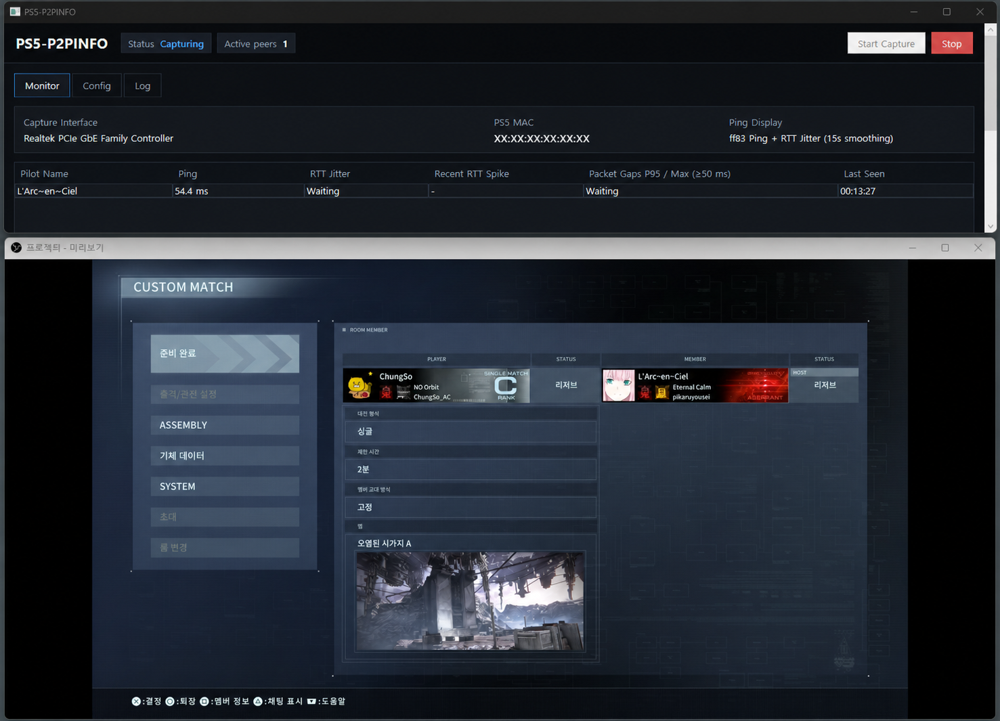
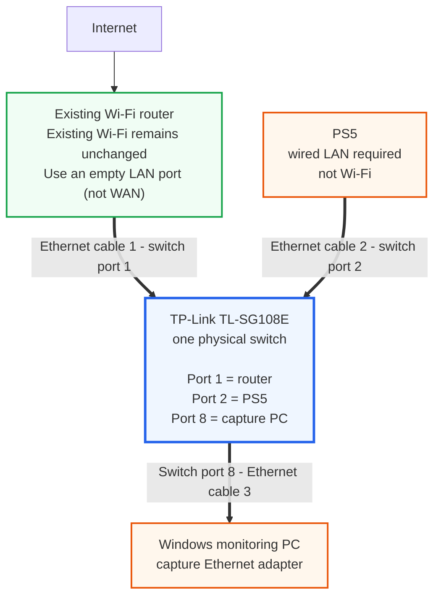
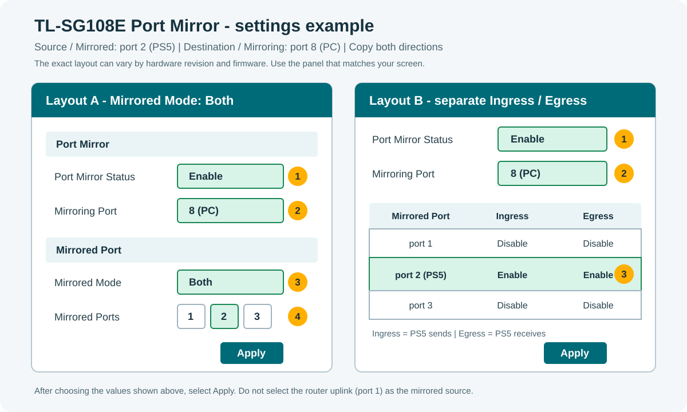

# PS5-P2PINFO

**English** | [한국어](README.ko.md) | [日本語](README.ja.md)

PS5-P2PINFO is a Windows monitoring tool for Armored Core peer traffic captured from a mirrored PS5 LAN port.

## Example screen

The PS5 MAC address is masked in this image.

## Download

- [Latest release page](https://github.com/Rubicon-Developers/PS5-P2P-INFO/releases/latest)
- [Download PS5-P2PINFO-Setup-x64.exe](https://github.com/Rubicon-Developers/PS5-P2P-INFO/releases/latest/download/PS5-P2PINFO-Setup-x64.exe) — most Intel and AMD PCs
- [Download PS5-P2PINFO-Setup-arm64.exe](https://github.com/Rubicon-Developers/PS5-P2P-INFO/releases/latest/download/PS5-P2PINFO-Setup-arm64.exe) — experimental ARM64 build, not tested on physical ARM64 hardware

This `.exe` is an installer built with Inno Setup, not a portable application file. It installs the application, creates the selected shortcuts, and adds a standard Windows uninstall entry. The application is self-contained, so a separate .NET installation is not required.

The installer is currently unsigned, so Windows SmartScreen may show a warning. Download it only from the official GitHub release link above.

## Features

- Pilot-name monitoring
- Ping and RTT jitter measurements
- Recent RTT spike diagnostics
- Packet-gap diagnostics
- Configurable display and capture settings

## Policies and Terms

Applicable policies and terms vary by country or region. This English document provides the official United States links. If you live elsewhere or use a PlayStation account registered in another region, review the current terms for that region. Additional terms presented within a game or service may also apply.

PS5-P2PINFO is designed with the intention of respecting and complying with applicable laws, platform policies, and terms of service.

### United States

- [PlayStation Terms of Service](https://www.playstation.com/en-us/legal/terms-of-service/)
- [PlayStation Software Application EULA](https://www.playstation.com/en-us/legal/software-eula/)
- [PS5 System Software Licence Agreement](https://www.playstation.com/en-us/legal/ps5-ssla/)
- [Bandai Namco Entertainment America Terms of Service](https://www.bandainamcoent.com/legal/bnea-tos-online-services)

## Supported environment

- Windows 10 or Windows 11, x64
- A router or managed switch that supports port mirroring
- Both PS5 traffic directions mirrored to the monitoring PC
- [Npcap](https://npcap.com/#download) installed with **WinPcap API-compatible Mode** enabled
- Administrator privileges to run the installer

> [!WARNING]
> A separate Windows ARM64 installer is provided as an experimental build. It was built successfully but has not been tested on physical ARM64 hardware. Installation, Npcap integration, and packet capture compatibility on ARM64 are therefore not confirmed.

If Npcap was installed with `Restrict Npcap driver's access to Administrators only`, starting capture may require UAC approval. Run PS5-P2PINFO as administrator only if a capture permission error persists.

## Installation and setup

This guide uses the most broadly compatible setup: your **existing Wi-Fi router plus a TP-Link TL-SG108E**. The TL-SG108E does not replace your router. It connects to a LAN port on the router, so your phones, laptops, Internet connection, and Wi-Fi continue to work as before.

> [!IMPORTANT]
> Check the `E` at the end of the model name before buying. `TL-SG108E` supports port mirroring; `TL-SG108` is an unmanaged switch and does not.

### 1. Gather the required equipment

- A Windows 10 or Windows 11 x64 PC
- A PS5 connected by wired LAN
- Your existing Wi-Fi router
- A [TP-Link TL-SG108E](https://www.tp-link.com/us/business-networking/easy-smart-switch/tl-sg108e/) 8-port Gigabit Easy Smart Switch
- Three Cat5e-or-better Ethernet cables
- A USB Gigabit Ethernet adapter if the PC does not have a wired Ethernet port

TP-Link lists Layer 2 port mirroring on the regional product pages below. The same Easy Smart Configuration Utility and official guide can be used for this setup.

| Region | Official product and support pages | Example price checked August 10, 2026 |
| --- | --- | --- |
| United States | [Product](https://www.tp-link.com/us/business-networking/easy-smart-switch/tl-sg108e/) · [Support and downloads](https://www.tp-link.com/us/support/download/tl-sg108e/) | [About US$29.99 at Lenovo](https://www.lenovo.com/buy/us/en/easy-setup-switches-0avz00a) |
| South Korea | [Product](https://www.tp-link.com/kr/business-networking/easy-smart-switch/tl-sg108e/) · [Support and downloads](https://www.tp-link.com/kr/support/download/tl-sg108e/) | [About KRW 36,000–43,000 on Danawa](https://prod.danawa.com/info/?pcode=4922979) |
| Japan | [Product](https://www.tp-link.com/jp/business-networking/easy-smart-switch/tl-sg108e/) · [Support and downloads](https://www.tp-link.com/jp/support/download/tl-sg108e/) | [About ¥3,960 and up on Kakaku.com](https://kakaku.com/item/K0000886515/) |

Price, stock, shipping, and hardware revisions can change. Confirm that the exact model is `TL-SG108E` before ordering.

Port mirroring is different from port forwarding. A router or switch that only advertises port forwarding cannot perform this setup.

### 2. Download the PS5-P2PINFO installer

1. Open the [latest GitHub release](https://github.com/Rubicon-Developers/PS5-P2P-INFO/releases/latest).
2. Under **Assets**, choose the installer that matches **Settings → System → About → System type**:
   - **x64-based processor**: [`PS5-P2PINFO-Setup-x64.exe`](https://github.com/Rubicon-Developers/PS5-P2P-INFO/releases/latest/download/PS5-P2PINFO-Setup-x64.exe) — use this on most Intel and AMD PCs.
   - **ARM-based processor**: [`PS5-P2PINFO-Setup-arm64.exe`](https://github.com/Rubicon-Developers/PS5-P2P-INFO/releases/latest/download/PS5-P2PINFO-Setup-arm64.exe) — experimental and not tested on physical ARM64 hardware.

<!-- Screenshot: assets/setup/common/01-github-release-assets.png
     Capture the release Assets list with both architecture-specific installers visible. -->

### 3. Install Npcap

PS5-P2PINFO uses Npcap to receive packets from the wired Ethernet adapter. Wireshark is not required. The free Npcap installer is not bundled with PS5-P2PINFO, so install it directly from the official website.

1. Open the [official Npcap download page](https://npcap.com/#download).
2. Under **Downloading and Installing Npcap Free Edition**, download the latest Npcap installer.
3. Run the installer and select **Yes** when Windows requests administrator permission.
4. Make sure **Install Npcap in WinPcap API-compatible Mode** is selected. Current Npcap releases select it by default, but confirm it on the installer screen.
5. **Restrict Npcap driver's access to Administrators only** is optional. Leaving it cleared lets standard users capture more conveniently; selecting it restricts capture access to administrators and can require UAC approval when capture starts.
6. **Support raw 802.11 traffic** is not required for this wired port-mirroring setup.
7. Complete the installation. Restart Windows if the installer asks you to do so.

<!-- Screenshot: assets/setup/common/02-npcap-download.png
     Capture the current Free Edition installer link on the official Npcap page. -->
<!-- Screenshot: assets/setup/common/03-npcap-winpcap-mode.png
     Capture the Npcap options page with WinPcap API-compatible Mode selected. -->

See the [Npcap Users' Guide](https://npcap.com/guide/npcap-users-guide.html#npcap-installation) for the official explanation of each installation option.

### 4. Install PS5-P2PINFO

1. Run the x64 or ARM64 installer selected above.
2. If Windows SmartScreen appears, confirm that you downloaded the file from the official GitHub release. Then select **More info**, confirm the filename is `PS5-P2PINFO-Setup-x64.exe` or `PS5-P2PINFO-Setup-arm64.exe` as selected, and choose **Run anyway**. Because the installer is unsigned, the publisher may be shown as **Unknown publisher**.
3. Select **Yes** when Windows requests administrator permission.
4. Read the Npcap requirement message and select **OK**.
5. On **Select Destination Location**, choose the installation folder. Keep the default folder if you are unsure.
6. On **Select Additional Tasks**, select **Create a desktop shortcut** if you want one.
7. On **Ready to Install**, review the options and select **Install**.
8. When installation finishes, leave **Launch PS5-P2PINFO** selected and choose **Finish**.

<!-- Screenshot: assets/setup/common/04-smartscreen.png -->
<!-- Screenshot: assets/setup/common/05-setup-npcap-notice.png -->
<!-- Screenshot: assets/setup/common/06-setup-destination.png -->
<!-- Screenshot: assets/setup/common/07-setup-additional-tasks.png -->
<!-- Screenshot: assets/setup/common/08-setup-ready.png -->
<!-- Screenshot: assets/setup/common/09-setup-complete.png -->

### 5. Connect the Ethernet cables

Use the port numbers below so that the remaining steps match the screenshots and settings exactly.

> [!NOTE]
> Only the three thick lines in the diagram are physical Ethernet cables. Copying traffic from `port 2 → port 8` is a TL-SG108E management setting—not another cable—and is covered in step 7 below.

1. Connect an unused **LAN** port on the existing Wi-Fi router to **port 1** on the TL-SG108E. Do not use the router's `WAN` or `Internet` port for this cable.
2. Connect the PS5 LAN port to **port 2** on the TL-SG108E.
3. Connect the monitoring PC's Ethernet port to **port 8** on the TL-SG108E.
4. Connect power to the TL-SG108E and wait one or two minutes.
5. Confirm that the link LEDs for ports 1, 2, and 8 turn on or blink.
6. On the PS5, open **Settings → Network → Settings → Set Up Internet Connection**, select **Set Up Wired LAN**, and connect through the cable.

TP-Link's [TL-SG108E support and downloads page](https://www.tp-link.com/us/support/download/tl-sg108e/) provides the official installation guide for each hardware revision. A PS5 connected over Wi-Fi does not pass through physical port 2 and cannot be captured with this wiring.

> [!WARNING]
> Do not connect the router and switch with two Ethernet cables. That can create a network loop.

### 6. Open the TL-SG108E management screen

The screens can differ slightly by hardware revision and firmware. Check the label on the bottom of the switch for a value such as `Ver: 6.0` or `Ver: 6.6` before downloading software.

1. On the [official TL-SG108E support page](https://www.tp-link.com/us/support/download/tl-sg108e/), select the hardware version that matches the label on the switch.
2. Download the latest **Easy Smart Configuration Utility** for Windows. If it is supplied as a ZIP file, extract it first, then run the installer `.exe` inside.
3. Make sure the PC is connected to port 8, then open the utility.
4. Wait for the utility to discover the switch. If it does not appear, select **Refresh**.
5. Select the **Login** icon on the discovered `TL-SG108E` row.
6. If the switch asks you to create an administrator username or password, follow the on-screen instructions. Older firmware may use `admin` for both the initial username and password; change the password immediately after signing in.

<!-- Screenshot: assets/setup/common/10-tplink-discovery.png
     Capture TL-SG108E in Discovered Switches and point to Login. Mask the switch MAC address. -->

The official [Easy Smart Configuration Utility User Guide - Discovering Switches](https://static.tp-link.com/upload/manual/2025/202510/20251023/1910013735_Easy%20Smart%20Configuration%20Utility_UG_1022.pdf#page=13) covers switch discovery, checking its assigned address, and signing in.

### 7. Mirror both directions of the PS5 port

Open **Monitoring → Port Mirror** and enter only the following values:

| Setting | Value | Purpose |
| --- | --- | --- |
| `Port Mirror Status` | `Enable` | Turns on port mirroring |
| `Mirroring Port` or `Destination` | `8` | PC port that receives the copied traffic |
| `Mirrored Port` or `Source` | `2` | PS5 port to monitor |
| `Mirrored Mode` | `Both` | Copies both incoming and outgoing PS5 traffic |

If your firmware shows separate `Ingress` and `Egress` options instead of `Both`, enable **both options for port 2**.

- `Ingress`: traffic sent by the PS5 into switch port 2
- `Egress`: traffic sent by the switch out of port 2 to the PS5

This is an instructional illustration of the values to enter. The actual screen can differ by hardware revision and firmware.

Select **Apply** to save the setting.

<!-- Screenshot: assets/setup/common/11-tplink-port-mirror-both.png
     Capture Monitoring > Port Mirror with Status=Enable, Mirroring Port=8,
     Mirrored Port=2, Mirrored Mode=Both. -->
<!-- Screenshot: assets/setup/common/12-tplink-port-mirror-directions.png
     Alternative UI: capture port 2 with Ingress=Enable and Egress=Enable,
     and Mirroring Port=8. -->

[TP-Link's official guide - Configuring Port Mirror](https://static.tp-link.com/upload/manual/2025/202510/20251023/1910013735_Easy%20Smart%20Configuration%20Utility_UG_1022.pdf#page=48) includes screenshots of the actual settings screen. See printed pages 44–45, which appear as PDF pages 48–49, for both the `Both` interface and the separate `Ingress`/`Egress` interface.

> [!CAUTION]
> Port 1 is the uplink to the router. Do not select port 1 as the `Mirrored` or `Source` port; doing so can copy traffic from other wired devices on the home network. Select only port 2, where the PS5 is connected.

### 8. Find the PS5 wired LAN MAC address

The PS5 has separate MAC addresses for Wi-Fi and wired LAN. PS5-P2PINFO requires the **wired LAN MAC address** for this setup.

1. On the PS5 home screen, select **Settings** in the upper-right corner.
2. Open **System → System Software → Console Information**.
3. Write down **MAC Address (LAN Cable)**.
4. Do not use **MAC Address (Wi-Fi)**.

The menu location is also shown in PlayStation's official [PS5 console information guide](https://www.playstation.com/en-us/support/hardware/playstation-system-software-application-version/).

<!-- Screenshot: assets/setup/en/13-ps5-lan-mac.png
     Capture Console Information in English. Mask console name, serial number and all real addresses. -->

### 9. Select the capture Ethernet adapter

1. Launch PS5-P2PINFO and open the **Config** tab.
2. Select **Choose Interface...**.
3. Select the physical Ethernet adapter connected to port 8 on the TL-SG108E.
4. Confirm that the correct row is highlighted, then select **Use Selected**.

PS5-P2PINFO may initially suggest an Ethernet adapter, but always confirm that it is the one physically connected to port 8. If the PC has multiple adapters, unplug and reconnect the port 8 cable and watch which Ethernet connection changes state in Windows.

Common physical-adapter names include `Realtek PCIe GbE Family Controller`, `Intel(R) Ethernet Controller`, and `USB Gigabit Ethernet`. Do not select:

- A Wi-Fi or Wireless adapter
- `NPF_Loopback` or `Adapter for loopback capture`
- A Bluetooth adapter
- A VPN, Hyper-V, VMware, or VirtualBox virtual adapter

<!-- Screenshot: assets/setup/common/14-app-interface-selection.png
     Capture a physical Ethernet row selected and the Use Selected button. -->

### 10. Enter and save the PS5 MAC address

1. In the **PS5 MAC Address** field on the **Config** tab, enter the wired LAN MAC address found in the previous step.
2. The recommended format is six pairs separated by colons, for example `AA:BB:CC:DD:EE:FF`.
3. Leave **Promiscuous mode** selected.
4. Keep the other advanced settings at their defaults for the first run.
5. Select **Save Config**.
6. Open the **Log** tab and confirm that `Configuration saved.` appears.

<!-- Screenshot: assets/setup/common/15-app-config.png
     Capture Config with the interface selected, a masked sample MAC,
     Promiscuous mode enabled and Save Config visible. -->

### 11. Start capture

1. Open the **Monitor** tab.
2. Select **Start Capture** in the upper-left corner.
3. Confirm that the status changes from `Ready` to `Capturing`.
4. On the PS5, enter an Armored Core online lobby or match.
5. When peer-to-peer traffic is detected, the `Active peers` count and monitor table update.
6. Select **Stop** when you are finished.

Selecting **Start Capture** also saves the current settings automatically. Use **Save Config** when you want to confirm the configuration before starting.

<!-- Screenshot: assets/setup/common/16-app-capturing.png
     Capture Status=Capturing and Active peers. Mask any user-identifying values. -->

### Troubleshooting

#### Start Capture is disabled

- Confirm that a capture Ethernet interface is selected.
- Confirm that the address contains 12 hexadecimal characters (`0–9`, `A–F`) after removing colons, hyphens, or periods, for example `AA:BB:CC:DD:EE:FF`.
- Confirm that you entered the PS5 wired LAN MAC address, not its Wi-Fi MAC address.

#### The application closes or shows Start failed after selecting Start Capture

- Reinstall the latest version of Npcap.
- Confirm that **WinPcap API-compatible Mode** is selected in the Npcap installer.
- If Npcap was installed with administrator-only access, approve the UAC request when capture starts. If a permission error persists, run PS5-P2PINFO **as administrator**.
- Check the last error shown on the **Log** tab.

#### Capturing is shown, but Active peers remains at 0

- Confirm that the PS5 is connected by cable to TL-SG108E port 2 rather than by Wi-Fi.
- Confirm that the order is `Mirrored/Source = 2` and `Mirroring/Destination = 8`.
- Confirm that `Both`, or both `Ingress` and `Egress` for port 2, is enabled.
- Confirm that the PC is connected to port 8 and that the same physical Ethernet adapter is selected in PS5-P2PINFO.
- Enter an online lobby or match where peer-to-peer traffic is actually present.

#### Ping is unavailable or unexpectedly unstable

- Both directions must be mirrored so that requests and replies can be matched. Check that both ingress and egress traffic for port 2 are enabled.
- Use only port 2, where the PS5 is directly connected, as the mirror source. Do not use the router uplink on port 1 as the source.

#### The PC also needs Internet access while capturing

The PC can use Wi-Fi or a second network adapter for its normal Internet connection while the port 8 Ethernet adapter is used for capture. Do not enable Windows Network Bridge or Internet Connection Sharing on the capture adapter.

## Source and license

This repository distributes release binaries and documentation only. The source code is not published, and no open-source license is granted. Copyright © 2026 Rubicon Developers. All rights reserved.

## Disclaimer

This is an independent community tool and is not affiliated with or endorsed by Sony Interactive Entertainment, FromSoftware, or Bandai Namco Entertainment.
